# JARVIS: Comprehensive Master Architecture (Deep-Dive Edition)

This diagram exposes every single minute detail of the Jarvis project including every model, library, API, thread, and process — from boot to shutdown.

Paste this into **[mermaid.live](https://mermaid.live)** or install the **Mermaid Preview** VS Code extension to render it.

```mermaid
flowchart TD
    %% ==========================================
    %% 0. MODELS REFERENCE BLOCK
    %% ==========================================
    subgraph "All AI Models Used in This Project"
        M1["🧠 Groq LPU: llama-3.1-70b-versatile | Fast Chat"]
        M2["👁️ NVIDIA NIM: meta/llama-3.2-11b-vision-instruct | Screen Vision"]
        M3["💻 NVIDIA NIM: meta/llama-3.1-8b-instruct | YouTube Summary"]
        M4["🔬 DeepSeek: deepseek-chat & deepseek-reasoner | Code & Reasoning"]
        M5["🌐 Google Gemini Pro | Fallback Brain"]
        M6["📴 Ollama: llama3.1:8b | Offline Local Brain"]
        M7["🎙️ faster-whisper: small.en | Speech-to-Text STT"]
        M8["🔊 Microsoft edge-tts: en-US-GuyNeural | Text-to-Speech TTS"]
        M9["🧬 sentence-transformers: all-MiniLM-L6-v2 | Local Vector Embeddings"]
        M10["🛡️ Llama-Guard-4 | Safety Content Filtering"]
        M11["👂 openwakeword: hey_jarvis ONNX | Wake Word Detection"]
    end

    %% ==========================================
    %% 1. INITIALIZATION & AUTHENTICATION
    %% ==========================================
    subgraph "Phase 1: Boot & Authentication Layer"
        Boot(("Boot jarvis.py")) --> Auth_Google["OAuth2: Google Calendar & Gmail API"]
        Auth_Google --> Check_Token{"Check token.pickle"}
        Check_Token -->|Valid| Load_Keys["Load .env Keys"]
        Check_Token -->|Invalid| Gen_Token["Browser Auth -> Create token.pickle"] --> Load_Keys
        Load_Keys -->|GROQ, NIM, GEMINI, DEEPSEEK, DISCORD| API_Clients["Initialize All Cloud API Clients"]
    end

    %% ==========================================
    %% 2. MODEL PRE-LOADING & THREADING
    %% ==========================================
    subgraph "Phase 2: Local Model Memory Loading"
        API_Clients --> Embed_Load["Load all-MiniLM-L6-v2 on CPU for RAG Embeddings"]
        API_Clients --> STT_Load["Load faster-whisper (small.en) on GPU/CPU with INT8/FP16"]
        API_Clients --> SOUL_Load["Load SOUL.md into System Prompt Context"]
        API_Clients --> MEM_Load["Load Past Chat History from MongoDB into Messages Array"]
    end

    subgraph "Phase 3: Concurrent Daemon Threads"
        STT_Load --> Thread_TTS["Thread 1: Async Edge-TTS Pygame Audio Queue"]
        STT_Load --> Thread_Discord["Thread 2: OpenClaw discord.py Event Loop"]
        STT_Load --> Thread_OWW["Thread 3: openwakeword Wake Word Monitor"]
    end

    %% ==========================================
    %% 3. INPUT GATHERING
    %% ==========================================
    subgraph "Phase 4: Multi-Channel Input Processing"
        Thread_Discord -->|User texts from phone| Discord_Recv["discord.on_message received"]
        
        Thread_OWW -->|PyAudio reads mic at 16kHz| OWW_Model["openwakeword ONNX Model: hey_jarvis"]
        OWW_Model -->|Confidence Score > 0.15| Wake_Trigger["Set wake_word_event flag"]

        Wake_Trigger --> Mic_Open["SpeechRecognition: Calibrate Ambient Noise 0.5s"]
        Mic_Open --> Audio_Capture["Listen: timeout=5s, phrase_time_limit=10s"]
        Audio_Capture --> Resample["Resample to 16000Hz & Normalize Amplitude Max"]
        Resample --> VAD["VAD Filter: min_silence_duration_ms=500"]
        VAD --> Transcribe["faster-whisper: transcribe with beam_size=5"]
        Transcribe -->|String| Input_Merge{{"Merge Input from both channels"}}
        Discord_Recv -->|String| Input_Merge
    end

    %% ==========================================
    %% 4. SAFETY CHECK
    %% ==========================================
    Input_Merge --> SafeCheck["Llama-Guard-4: check_safety()"]
    SafeCheck -->|Harmful| Reject(("Block & Warn User"))
    SafeCheck -->|Safe| Heuristic_Router

    %% ==========================================
    %% 5. HEURISTIC ACTION CONTROLLER
    %% ==========================================
    subgraph "Phase 5: The Claw - OS-Level Action Controller"
        Heuristic_Router{"execute_computer_action: Keyword & Regex Match"}

        Heuristic_Router -->|pause/next/mute music| Action_Media["pyautogui.press playpause / nexttrack / volumemute"]
        Heuristic_Router -->|system status| Action_Diag["psutil: cpu_percent, virtual_memory, disk_usage, battery"]
        Heuristic_Router -->|scrape website| Action_Scrape["playwright: chromium.launch headless=True"]
        Action_Scrape --> DOM_Bypass["page.goto URL then page.evaluate document.body.innerText"]
        DOM_Bypass --> Scrape_AI["LLM summarizes scraped text with user question"]
        Heuristic_Router -->|send email| Action_Mail["google-auth + googleapiclient gmail v1"]
        Action_Mail --> Base64_Mail["EmailMessage -> base64 encode -> service.users.messages.send"]
        Heuristic_Router -->|open youtube| Action_YT["pywhatkit.playonyt + pyautogui autoplay click"]
        Heuristic_Router -->|summarize video| Action_YT_Sum["youtube-transcript-api: get_transcript()"]
        Action_YT_Sum --> YT_AI_Summarizer["NVIDIA NIM: meta/llama-3.1-8b-instruct -> bullet summary"]
        Heuristic_Router -->|send file on whatsapp| Action_WA["os.walk Desktop+Downloads -> pywhatkit.sendwhatmsg_instantly"]
        Heuristic_Router -->|check calendar| Action_Cal["googleapiclient: calendar.events.list timeMin=now"]
        Heuristic_Router -->|add task / show tasks| Action_Tasks["pymongo: insert_one / find_all in tasks collection"]
        Heuristic_Router -->|look at this / screen| Action_Vision["pyautogui.screenshot -> Base64 encode image"]
        Action_Vision --> NIM_Vis["NVIDIA NIM: meta/llama-3.2-11b-vision-instruct"]
    end

    %% ==========================================
    %% 6. LONG-TERM MEMORY (RAG)
    %% ==========================================
    Heuristic_Router -->|No OS command match| RAG_Query

    subgraph "Phase 6: Long-Term RAG Memory Pipeline"
        RAG_Query["all-MiniLM-L6-v2: encode user text to 384-dim vector"] --> RAG_Search[("MongoDB Atlas: jarvis_brain.memories collection")]
        RAG_Search -->|numpy cosine_similarity > 0.3| RAG_Inject["Inject top-3 past memories into System Prompt"]
        RAG_Inject --> Context_Builder["Build Final Prompt: SOUL.md + History + RAG + User Query"]
    end

    %% ==========================================
    %% 7. MULTI-MODAL BRAIN ROUTING
    %% ==========================================
    Context_Builder --> AI_Router{"determine_route: Heuristic Intent Classifier"}

    subgraph "Phase 7: Multi-Modal Cloud & Local Brains"
        AI_Router -->|vision keywords| NIM_Vis
        AI_Router -->|code/debug/python| Route_Code["DeepSeek API: deepseek-chat / deepseek-reasoner"]
        AI_Router -->|research/think/complex| Route_Reason["NVIDIA NIM: Reasoning with thinking=True"]
        AI_Router -->|general chat| Groq_Chat["Groq LPU: llama-3.1-70b-versatile 300+ tokens/sec"]
        AI_Router -->|no internet| Ollama_Loc["Ollama Local Fallback: llama3.1:8b"]
        Groq_Chat -.->|Rate limit or Timeout| Gemini_Fallback["Google Gemini Pro API Fallback"]
    end

    %% ==========================================
    %% 8. OUTPUT STREAMING & TTS
    %% ==========================================
    Action_Media & Action_Diag & Scrape_AI & Base64_Mail & YT_AI_Summarizer & Action_WA & Action_Cal & Action_Tasks & NIM_Vis & Route_Code & Route_Reason & Groq_Chat & Ollama_Loc & Gemini_Fallback -->|Text Response| Text_Sanitizer

    subgraph "Phase 8: Asynchronous Streaming Voice Output"
        Text_Sanitizer{"Strip * # _ emoji chars + isalnum check"} --> Sent_Chunker["Split by sentence delimiters . ! ?"]
        Sent_Chunker --> TTS_Engine["edge-tts Communicate: en-US-GuyNeural"]
        TTS_Engine -->|Stream audio bytes| Q["queue.Queue: async put"]
        Q --> Pygame["pygame.mixer.music.load + play"]
        Pygame --> Speakers(("Laptop Speakers Output"))
        Pygame --> Save_Mem["After reply: save_memory() writes to MongoDB"]
    end

    %% ==========================================
    %% 9. TRUE VOICE INTERRUPTION & LOOP BACK
    %% ==========================================
    Speakers -.->|Speaker audio bleeds into room| OWW_Model
    OWW_Model -.->|Hears Jarvis mid-speech| Interrupt_Trigger["Wake Word fires Interrupt Signal"]

    subgraph "Phase 9: Hardware Cutoff & Echo Prevention"
        Interrupt_Trigger --> Flush_Q["queue.Queue: drain all pending sentences via get_nowait"]
        Flush_Q --> Stop_Audio["pygame.mixer.music.stop - immediate hardware cutoff"]
        Stop_Audio --> Reverb_Delay["time.sleep 0.8s - wait for acoustic echo to decay"]
        Reverb_Delay --> Mic_Open
    end

    %% ==========================================
    %% 10. SHUTDOWN
    %% ==========================================
    Heuristic_Router -->|shutdown / goodbye| Shutdown(("KeyboardInterrupt: Kill all threads & exit"))
```

