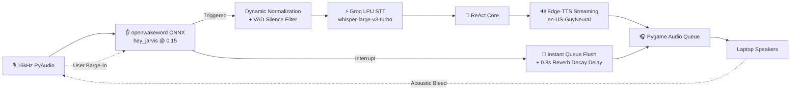

# JARVIS V2: Master Architecture & System Design Documentation

This document provides the authoritative architecture and system design specification for **JARVIS V2** (*Autonomous Multimodal AI Agent OS*).

---

## 1. High-Level System Architecture

JARVIS V2 is engineered around an asynchronous, event-driven orchestration loop that connects multi-modal user interfaces, native ReAct planning, resilient model routing, and persistent database storage.

```
                           +----------------------------------------+
                           |          User Input Channels           |
                           |  [Voice / Mic] [Discord] [REST API]   |
                           +----------------------------------------+
                                                |
                                                v
                           +----------------------------------------+
                           |              Orchestrator              |
                           |   Session Context & Stream Dispatcher  |
                           +----------------------------------------+
                                                |
                                                v
                           +----------------------------------------+
                           |         Native ReAct / Planner         |
                           |  Decomposition, Goal Tracking, Memory  |
                           +----------------------------------------+
                                                |
                                                v
                           +----------------------------------------+
                           |          Unified Model Gateway         |
                           |  Groq LPU | NIM | DeepSeek | Gemini    |
                           |     Circuit Breaker & Fallback         |
                           +----------------------------------------+
                                                |
                        +-----------------------+-----------------------+
                        |                                               |
                        v                                               v
        +-------------------------------+               +-------------------------------+
        |    Tool Execution & The Claw  |               |       Direct Generation       |
        |  Pydantic Validated Schemas   |               |   Streaming Text / Voice      |
        +-------------------------------+               +-------------------------------+
                        |                                               |
                        v                                               |
        +-------------------------------+                               |
        |    Verification & Recovery    |                               |
        | Goal Preserving Replanning    |                               |
        +-------------------------------+                               |
                        |                                               |
                        +-----------------------+-----------------------+
                                                |
                                                v
                           +----------------------------------------+
                           |    Storage, Memory & Scheduler Core    |
                           +----------------------------------------+
                                   |                        |
        [AUTHORITATIVE TRUTH]      v                        v      [LOCAL RESILIENCE]
                 +-----------------------+    +-----------------------+
                 | Supabase PostgreSQL   |    | Local SQLite Cache    |
                 | - GoTrue Auth & RLS   |    | - Offline Queue       |
                 | - pgvector Embeddings |    | - Fallback Resilience |
                 | - Tasks & Schedules   |    +-----------------------+
                 | - Knowledge Graph     |
                 +-----------------------+
```

---

## 2. Security Architecture & Identity Isolation

JARVIS V2 adheres to a strict zero-trust security perimeter. End-user identities are never derived from untrusted client parameters; all persistent access is mediated via cryptographically signed JWTs and enforced directly inside PostgreSQL via Row-Level Security (RLS).

```
                            User Request / Command
                                      │
                                      ▼
                           Bearer JWT Access Token
                                      │
                                      ▼
                        Supabase GoTrue Authentication
                                      │
                                      ▼
                            Verified User Identity
                                 (auth.uid())
                                      │
                                      ▼
                        PostgreSQL Row-Level Security
                   (tenant isolation enforced in database)
                                      │
                                      ▼
                              User-Owned Data
              (memories, documents, tasks, schedules, audit)
```

### Security Tenets
1. **JWT-Propagated RLS:** Queries to Supabase execute under the context of the calling user's Bearer JWT. Row-Level Security policies evaluate `auth.uid() = user_id`, guaranteeing cross-tenant data isolation at the storage engine level.
2. **Admin Privilege Isolation:** The `SUPABASE_SERVICE_ROLE_KEY` is strictly reserved for server-side initialization and automated test suite provisioning. It is never exposed client-side or utilized for routine user operations.
3. **Execution Safety Gate (Policy Engine):** Actions are categorized by risk:
   - **Level 0–2 (Read/Diagnostic):** Executed autonomously (e.g., system stats, calendar read).
   - **Level 3–4 (Side-Effects/Destructive):** Require explicit user confirmation before execution (e.g., dispatching emails, deleting files, system shutdown).
4. **Prompt Injection Containment:** Untrusted external content (web scrape output, YouTube transcripts) is encapsulated in strict delimiter boundaries (`<<<BEGIN_UNTRUSTED_EXTERNAL_DATA>>>`) before passing to neural models.

---

## 3. Database Architecture: Authoritative Truth vs. Local Cache

Storage in JARVIS V2 is divided into two distinct tiers:

```
                            JARVIS V2 Storage
                                    │
                  ┌─────────────────┴─────────────────┐
                  ▼                                   ▼
        Supabase PostgreSQL                     Local SQLite
        + pgvector + Auth                       Cache / Queue
        + Row-Level Security                    Offline Resilience
                  │                                   │
                  ▼                                   ▼
        AUTHORITATIVE PERSISTENT             LOCAL CLIENT CACHE
             SOURCE OF TRUTH                 & EMBEDDED FALLBACK
```

### Authoritative Persistent Backend (Supabase PostgreSQL)
Supabase is the primary, authoritative persistent store for all production workflows:
- **`auth.users`:** Identity provider managing cryptographically verified JWT tokens.
- **`memories`:** Long-term episodic and semantic memory with 384-dimensional vector embeddings (`ivfflat` cosine distance indexing).
- **`documents`:** Ingested reference documents and chunks for knowledge retrieval with hybrid RRF search.
- **`tasks`:** Persistent to-do items and execution status tracking.
- **`scheduled_tasks`:** Cron and one-time reminders with atomic claim operations (`status='claimed'`) to prevent multi-worker race conditions.
- **`memory_links`:** Directional knowledge graph relations (`User -[PREFERS]-> Theme`).
- **`audit_logs`:** Append-only security audit trail recording actor, action, payload hash, and outcome.

### Local SQLite Cache (`jarvis_local_cache.db`)
SQLite serves strictly as an auxiliary resilience cache:
- Provides offline caching when cloud connectivity is unavailable.
- Maintains a local write-ahead queue that synchronizes upon cloud reconnection.
- Powers fast, hermetic local testing without requiring external credentials.
- **Note:** SQLite is never treated as a second authoritative database.

---

## 4. Autonomous Agent Architecture (ReAct Loop)

The autonomous core executes a native Reasoning-Action (ReAct) cycle with goal-preserving recovery:

```
                          User Intent / Goal
                                  │
                                  ▼
                         Autonomous Planner
                     (Breaks down multi-step goal)
                                  │
                                  ▼
                        Model Gateway Router
                 (Selects model with tool-calling support)
                                  │
                                  ▼
                         Native Tool Calling
                 (Emits structured JSON tool arguments)
                                  │
                                  ▼
                        Execution ("The Claw")
               (Dispatches validated tool via Registry)
                                  │
                                  ▼
                         Tool Observation
                   (Captures execution stdout / data)
                                  │
                                  ▼
                       Verification & Reflection
                 ┌────────────────┴────────────────┐
                 ▼                                 ▼
             Success                            Failure
                 │                                 │
                 ▼                                 ▼
         Proceed to Next Step            Goal-Preserving Recovery
                 │                       (Adjusts parameters or
                 │                        selects alternate tool)
                 └────────────────┬────────────────┘
                                  │
                                  ▼
                            Final Output
                      (Formatted Voice & Chat)
```

### Self-Correction & Goal Preservation
When a step fails (e.g., network error on web scraping or invalid search query), the agent does not abort the user's objective. The observation is fed back to the planner, which analyzes the error, adjusts query parameters or tool selection, and attempts recovery until completion or reaching the step limit.

---

## 5. Neural Model Gateway & Routing Roster

The Model Gateway provides automatic capability classification, load-adaptive routing, circuit breakers, and provider fallback:

```
[User Request]
       │
       ▼
[Model Router]
       │
       ├── Chat / Fast Intent  ──► Primary: Groq LPU (qwen/qwen3.8-27b)
       │                              Fallback: NVIDIA NIM (nemotron-3.5-lightning-30b-a3b)
       │
       ├── Vision / Screen      ──► Primary: NVIDIA NIM (meta/llama-3.2-11b-vision-instruct)
       │                              Fallback: Google Gemini (gemini-2.0-flash)
       │
       ├── Audio+Vision Multi  ──► NVIDIA NIM (microsoft/phi-4-multimodal-instruct)
       │
       ├── Code & Engineering   ──► Primary: DeepSeek (deepseek-ai/deepseek-chat)
       │                              Fallback: NVIDIA NIM (nemotron-3-ultra-550b-a55b)
       │
       ├── Deep Reasoning       ──► Primary: DeepSeek (deepseek-ai/deepseek-reasoner)
       │                              Fallback: NVIDIA NIM Reasoning
       │
       ├── Speech-to-Text (STT) ──► Primary: Groq LPU (whisper-large-v3-turbo) (~80ms)
       │                              Fallback: Local faster-whisper (small.en)
       │
       └── Offline Fallback     ──► Local Ollama daemon (llama3.1:8b)
```

---

## 6. Real-Time Voice & Audio Pipeline

JARVIS V2 implements an ultra-low-latency, zero-leak audio pipeline designed for continuous operation:


```mermaid
flowchart LR
    Mic[🎙️ 16kHz PyAudio] --> OWW[👂 openwakeword ONNX\nhey_jarvis @ 0.15]
    OWW -->|Triggered| VAD[Dynamic Normalization\n+ VAD Silence Filter]
    VAD --> STT[⚡ Groq LPU STT\nwhisper-large-v3-turbo]
    STT --> Agent[🧠 ReAct Core]
    Agent --> TTS[🔊 Edge-TTS Streaming\nen-US-GuyNeural]
    TTS --> Mixer[🎧 Pygame Audio Queue]
    Mixer --> Speaker[Laptop Speakers]

    Speaker -.->|Acoustic Bleed| Mic
    Mic -.->|User Barge-In| OWW
    OWW -->|Interrupt| Cutoff[🛑 Instant Queue Flush\n+ 0.8s Reverb Decay Delay]
    Cutoff --> Mixer
```

1. **Wake-Word Monitoring:** Runs in a dedicated daemon thread scanning at 16kHz for the `"hey_jarvis"` wake word with confidence threshold `0.15`.
2. **Barge-In Interruption:** When the user speaks while JARVIS is responding, the wake word fires an immediate interrupt, halting the audio mixer and applying an `0.8s` acoustic decay pause to prevent feedback.
3. **Low-Latency Speech Processing:** Transcriptions are dispatched to Groq's LPU-accelerated Whisper model, completing in ~80ms without exhausting local CPU/GPU memory.

---

## 7. System Directory Layout

```
Jarvis/
├── agents/                     # ReAct autonomous planning & tool-calling agent
│   ├── base.py                 # Abstract agent interface
│   ├── planner.py              # Step-by-step goal decomposition & state tracker
│   └── react_agent.py          # Native tool-calling ReAct execution loop
├── api/                        # REST & Webhook endpoints
│   ├── routes.py               # FastAPI router endpoints
│   └── server.py               # ASGI application entrypoint
├── app/                        # Application entrypoints & lifecycle management
│   ├── bootstrap.py            # Component initialization & pre-flight checks
│   └── main.py                 # Interactive shell & daemon lifecycle
├── core/                       # Core configuration, schemas, and policy enforcement
│   ├── config.py               # Pydantic Settings configuration loader
│   ├── health_check.py         # Subsystem diagnostic engine (python jarvis.py health)
│   ├── orchestrator.py         # Central session manager and event dispatcher
│   ├── policy.py               # Level 0-4 risk authorization engine
│   └── schemas.py              # Strongly-typed Pydantic schemas
├── memory/                     # RAG, Vector Search, and Knowledge Graph
│   ├── embedding.py            # all-MiniLM-L6-v2 CPU embedding pipeline (384-dim)
│   ├── graph.py                # Personal entity relationship graph
│   └── rag.py                  # User-scoped hybrid retrieval (dense + sparse)
├── models/                     # Multi-provider model gateway and routing
│   ├── gateway.py              # Unified gateway with circuit breaker & fallback
│   ├── health.py               # Provider latency & error-rate tracker
│   ├── router.py               # Intent classifier & optimal provider selector
│   └── providers/              # Groq, NIM, DeepSeek, Gemini, and Ollama adapters
├── notifications/              # Multi-channel notification delivery (Voice, Discord, Toast)
│   └── manager.py              # Priority-based notification manager
├── observability/              # Logging, performance tracing, and security auditing
│   ├── audit.py                # Tamper-evident append-only security logger
│   └── logger.py               # Structured JSON logger
├── scheduler/                  # Background task automation & cron engine
│   └── scheduler.py            # Persistent scheduler with atomic Supabase claim
├── security/                   # Sanitization and prompt injection defense
│   └── sanitizer.py            # Input/output sanitizer and untrusted data boundary wrapper
├── storage/                    # Authoritative Supabase & SQLite resilience layer
│   ├── base.py                 # Abstract storage interface
│   ├── sqlite_cache.py         # Local offline SQLite cache & queue
│   └── supabase.py             # Supabase PostgreSQL + pgvector + RLS client
├── tests/                      # Verification suites
│   ├── unit/                   # Hermetic unit tests (mocked providers/DB)
│   └── integration/            # Live Supabase and end-to-end agent workflows
├── tools/                      # The Claw - Typed Tool Registry
│   ├── registry.py             # Tool decorator, metadata, and dispatcher
│   ├── browser/                # Playwright headless browser automation
│   ├── communication/          # Google Gmail & WhatsApp automation
│   ├── files/                  # Windows filesystem search and management
│   ├── media/                  # Spotify & Windows media controller
│   ├── productivity/           # Google Calendar & Tasks integration
│   ├── system/                 # psutil metrics and Windows OS actions
│   ├── vision/                 # PyAutoGUI screen capture & OCR
│   └── youtube/                # Video transcript extraction & summarization
├── voice/                      # Voice input/output subsystems
│   ├── audio.py                # PyAudio stream controller & amplitude normalization
│   ├── stt.py                  # Groq whisper-large-v3-turbo + faster-whisper fallback
│   ├── tts.py                  # edge-tts async streamer with Pygame playback
│   └── wakeword.py             # openwakeword ONNX continuous wake detector
├── jarvis.py                   # Root CLI entrypoint (start, health, test)
├── pyproject.toml              # Project metadata & dependencies (v2.0.0)
├── .env.example                # Sanitized configuration template
└── README.md                   # Primary project documentation
```
