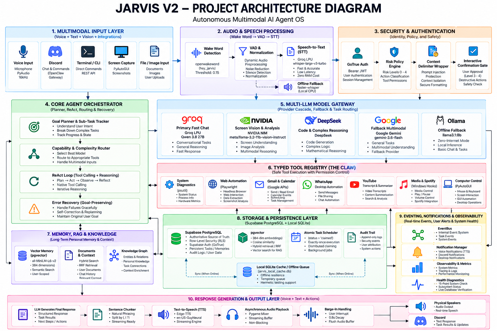

<div align="center">
  
  
  
  
  
  <h1>JARVIS V2</h1>
  <p><strong>Autonomous Multimodal AI Agent OS</strong></p>
</div>

---

## Overview

**JARVIS V2** (*Just A Rather Very Intelligent System*) is a production-grade, autonomous personal AI agent operating system designed for Windows. Combining ultra-low-latency on-device interaction with state-of-the-art cloud intelligence, JARVIS orchestrates real-time voice, computer vision, multi-step autonomous planning, and secure OS-level automation.

JARVIS is built on a **hybrid edge-cloud architecture** where **Supabase PostgreSQL + pgvector** serves as the authoritative source of truth for identity, memory, tasks, and security, backed by a local SQLite cache for offline resilience.

---

## Key Capabilities

1. **Continuous Voice Pipeline:** Real-time wake-word detection (`"hey_jarvis"` via `openwakeword`), LPU-accelerated speech-to-text (~80ms via Groq Whisper Large v3 Turbo), and chunked streaming speech synthesis via Microsoft Edge-TTS.
2. **True Barge-In Interruption:** Speaks asynchronously and listens continuously. If interrupted by the user, JARVIS immediately cuts audio playback and applies an `0.8s` acoustic reverb decay window to prevent self-trigger feedback.
3. **Screen Perception & Vision:** Implicit and explicit screen capture via PyAutoGUI with visual reasoning powered by NVIDIA NIM Llama 3.2 11B Vision and Google Gemini 2.0 Flash.
4. **Native ReAct Planning & Execution:** Multi-step autonomous goal decomposition with native tool calling, step-by-step verification, and goal-preserving error recovery.
5. **Authoritative Cloud Memory (RAG):** User-scoped vector search over long-term episodic memories and reference documents using 384-dimensional `all-MiniLM-L6-v2` dense embeddings in Supabase `pgvector`.
6. **OS-Level Tool Execution ("The Claw"):** Typed, Pydantic-validated tool integrations for Windows management, filesystem manipulation, Spotify/media playback, Google Calendar, and Gmail.
7. **Playwright Web Automation:** Resilient headless Chromium browser automation bypassing brittle CSS selectors through direct JavaScript innerText evaluation.
8. **YouTube Intelligence:** Automated URL extraction, transcript retrieval via `youtube-transcript-api`, and structured multi-point summarization.
9. **Remote Discord Gateway ("OpenClaw"):** Secure mobile access allowing full remote agent interaction protected by a strict user-ID whitelist.
10. **Policy & Risk Engine:** Four-tier authorization model (Levels 0–4) enforcing explicit interactive confirmation before executing irreversible or high-risk actions.
11. **Zero-Trust Cross-Tenant Security:** Cryptographically verified JWT authentication with PostgreSQL Row-Level Security (RLS) guaranteeing total isolation of user data.

---

## Architecture

<div align="center">
  
</div>

JARVIS V2 operates on a decoupled, event-driven architecture connecting sensory inputs to an autonomous reasoning core and authoritative storage:

```
                            JARVIS V2 Architecture
                                      │
          ┌───────────────────────────┴───────────────────────────┐
          ▼                                                       ▼
  Supabase PostgreSQL                                        Local SQLite
  + pgvector + GoTrue Auth                                   Cache & Queue
  + Row-Level Security (RLS)                                 Offline Support
          │                                                       │
          ▼                                                       ▼
AUTHORITATIVE SOURCE OF TRUTH                              RESILIENCE CACHE
```

### End-to-End Execution Flow
```
User Request (Voice / Text / Discord)
   │
   ▼
Orchestrator (Session & Stream Management)
   │
   ▼
Autonomous Planner (Goal Decomposition & Tracking)
   │
   ▼
Model Gateway (Intent Classification & Provider Fallback)
   │
   ▼
Native Tool Calling (Structured JSON Tool Arguments)
   │
   ▼
Tool Execution (The Claw - Typed Tool Registry)
   │
   ▼
Observation & Verification (Output Inspection)
   │
   ├── [On Failure] ──► Goal-Preserving Recovery & Replanning
   │
   ▼
Memory & Audit Persistence (Supabase pgvector + Audit Logs)
   │
   ▼
Synthesized Output (Voice Stream / Discord / Terminal)
```

For full system diagrams and component breakdowns, see [JARVIS_ARCHITECTURE.md](docs/architecture/ARCHITECTURE.md).

---

## Technology Stack

| Layer | Technologies | Purpose |
| :--- | :--- | :--- |
| **Language & Runtime** | Python 3.11+, Windows 10/11 | Core OS agent execution |
| **Authoritative Database** | Supabase (PostgreSQL 15+, pgvector, GoTrue) | Primary database, authentication, RLS, vector indexing |
| **Resilience Cache** | Embedded SQLite (`jarvis_local_cache.db`) | Local offline cache and queue |
| **Neural Inference** | Groq LPU, NVIDIA NIM, DeepSeek, Google Gemini | Cloud model gateway with automated fallback |
| **Local Inference** | Ollama (`llama3.1:8b`) | On-device zero-internet offline fallback |
| **Embeddings & RAG** | `sentence-transformers/all-MiniLM-L6-v2` | 384-dimensional dense vectors (CPU zero-cost) |
| **Voice & Audio** | `openwakeword`, `faster-whisper`, `edge-tts`, `pygame` | Wake word, STT, streaming TTS, barge-in audio control |
| **Automation & Vision** | Playwright, PyAutoGUI, psutil, pywhatkit | Browser automation, screen capture, OS metrics |
| **Integrations** | Google APIs (Gmail, Calendar), Discord.py | Productivity and remote access |
| **Validation & Schema** | Pydantic v2, Pydantic-Settings | Typed schemas, configuration, tool signatures |
| **Testing** | Pytest, AnyIO | Hermetic and live cloud integration testing |

---

## Core Components

- **`core/orchestrator.py`:** Central coordinator managing user sessions, state, memory injection, and speech dispatching.
- **`core/health_check.py`:** Comprehensive diagnostic engine evaluating the readiness of all 15 system subsystems (`python jarvis.py health`).
- **`core/policy.py`:** Security gatekeeper enforcing Level 0–4 risk policies and interactive confirmations.
- **`agents/planner.py`:** Goal decomposition engine breaking complex objectives into structured sub-tasks.
- **`agents/react_agent.py`:** Native tool-calling ReAct loop with multi-turn conversation memory and self-correction.
- **`storage/supabase.py`:** Supabase PostgreSQL adapter enforcing JWT bearer authentication and RLS isolation.
- **`storage/sqlite_cache.py`:** Local SQLite fallback caching tasks and memories during offline operation.
- **`scheduler/scheduler.py`:** Background job scheduler supporting cron and one-time reminders with atomic claim semantics.

---

## AI / Agent Architecture

JARVIS V2 implements an autonomous **ReAct (Reasoning + Action)** pattern:

```
User Goal
   │
   ▼
[Planner: Plan Steps]
   │
   ▼
[Model Gateway: Select Model]
   │
   ▼
[Provider: Generate Tool Call]
   │
   ▼
[Registry: Execute Tool]
   │
   ▼
[Observation: Inspect Result]
   │
   ├── Success ──► Advance Plan Step
   │
   └── Failure ──► Goal-Preserving Recovery (Adjust tool / args)
   │
   ▼
[Planner: Synthesize Response]
```

### Model Gateway & Provider Cascade
Queries are classified by the `ModelRouter` and dispatched through a resilient circuit-breaker cascade:

- **Fast Chat / General:** Groq LPU (`qwen/qwen3.8-27b`) → NVIDIA NIM (`nvidia/nemotron-3.5-lightning-30b-a3b`).
- **Vision & Screen:** NVIDIA NIM (`meta/llama-3.2-11b-vision-instruct`) → Google Gemini (`gemini-2.0-flash`).
- **Audio + Vision:** NVIDIA NIM (`microsoft/phi-4-multimodal-instruct`).
- **Code & Engineering:** DeepSeek (`deepseek-ai/deepseek-chat`) → NVIDIA NIM (`nvidia/nemotron-3-ultra-550b-a55b`).
- **Deep Reasoning:** DeepSeek (`deepseek-ai/deepseek-reasoner`) → NVIDIA NIM Reasoning.
- **Speech-to-Text:** Groq LPU (`whisper-large-v3-turbo`, ~80ms) → Local `faster-whisper` (`small.en`).
- **Offline Fallback:** Local Ollama daemon (`llama3.1:8b`).

---

## Memory & RAG

1. **Local Vector Encoding:** Text queries and memory candidates are encoded locally on the CPU using `sentence-transformers/all-MiniLM-L6-v2` into 384-dimensional dense vectors.
2. **Authoritative Storage:** Vectors are stored directly in Supabase PostgreSQL inside the `memories` table, indexed using `ivfflat` cosine distance (`vector_cosine_ops`).
3. **User-Scoped Retrieval:** Every retrieval query filters strictly on `user_id = auth.uid()`.
4. **Hybrid Relevance Scoring:** Search results combine vector cosine similarity, temporal recency decay, and importance weighting.
5. **Knowledge Graph (`memory_links`):** Structured entity-relation tracking (`Setty Bhavithav -[PREFERS]-> Dark Mode`).

---

## Database Architecture

### Authoritative Persistent Backend (Supabase)
Supabase PostgreSQL is the authoritative system of record:
- **`auth.users`:** Identity provider issuing cryptographically signed JWTs.
- **`memories`:** Vector-indexed episodic and factual memory.
- **`documents`:** RAG reference documents and ingested knowledge chunks.
- **`tasks`:** Persistent to-do items and execution status.
- **`scheduled_tasks`:** Scheduled automation jobs with atomic status claiming (`pending` → `claimed` → `completed`).
- **`memory_links`:** Directional semantic relationships.
- **`audit_logs`:** Tamper-evident append-only security logs.

### Local SQLite Cache (`jarvis_local_cache.db`)
SQLite provides secondary local resilience:
- Operates as a write-ahead queue when cloud connectivity is unavailable.
- Caches recent memories and tasks locally for instant retrieval.
- Enables offline hermetic testing without live database credentials.
- **SQLite is strictly an auxiliary cache, never an authoritative primary.**

---

## Authentication & Security Model

JARVIS V2 implements an end-to-end zero-trust architecture:

```
User Request
     │
     ▼
Bearer JWT Access Token
     │
     ▼
Verified Identity: auth.uid()
     │
     ▼
PostgreSQL Row-Level Security (RLS)
     │
     ▼
User-Isolated Records
```

- **Identity Propagation:** Requests to Supabase include the user's verified Bearer JWT. Untrusted user ID fields in request bodies are never trusted as identity.
- **Row-Level Security:** PostgreSQL enforces `auth.uid() = user_id` across all operations. Cross-user access is impossible even if application-level bugs occur.
- **Administrative Isolation:** The `SUPABASE_SERVICE_ROLE_KEY` is restricted strictly to server-side initialization and automated test suite provisioning. It is never exposed client-side or utilized in daily user flows.
- **Execution Confirmation:** Destructive operations (file deletion, process termination, sending emails) require explicit interactive confirmation (Level 3/4).
- **Prompt Injection Defense:** External untrusted data is encapsulated in explicit boundary tags (`<<<BEGIN_UNTRUSTED_EXTERNAL_DATA>>>`).

---

## Voice & Vision

- **Continuous Wake-Word:** An ONNX-optimized `openwakeword` model scans 16kHz microphone audio for `"hey_jarvis"` at a sensitive `0.15` threshold.
- **Groq LPU STT:** Audio frames are packaged into in-memory WAV buffers and transcribed via Groq's `whisper-large-v3-turbo` in ~80ms.
- **Streaming TTS & Barge-In:** Text tokens are chunked into natural sentences and synthesized via Microsoft Edge-TTS (`en-US-GuyNeural`) into an asynchronous Pygame audio stream. If the user speaks mid-sentence, JARVIS detects the wake word, drains the audio buffer immediately, stops playback, and applies an `0.8s` reverb decay delay.
- **Desktop Screen Vision:** PyAutoGUI captures the primary display silently upon contextual user triggers (*"What's on my screen?"*, *"Look at this error"*) and forwards the base64-encoded frame to NVIDIA NIM Vision or Gemini 2.0 Flash.

---

## Computer / Browser Automation

- **Headless Web Scraping:** Playwright Chromium launches headlessly to retrieve dynamic single-page web applications, extracting text via direct DOM `document.body.innerText` evaluation.
- **YouTube Summarization:** Given a YouTube link or query, extracts subtitles via `youtube-transcript-api` and generates concise, structured bullet-point summaries.
- **Windows System Control:** Real-time hardware telemetry (CPU, RAM, disk, battery) via `psutil`. Desktop media control (Spotify play/pause, next track, volume) via low-level Windows keyboard hooks.

---

## Integrations

- **Google Workspace (Gmail & Calendar):** OAuth2-authenticated Gmail client to compose and send emails; Calendar integration to inspect daily agendas and upcoming meetings.
- **WhatsApp Desktop Automation:** Searches local filesystem directories (Desktop, Downloads) for requested documents and automates delivery via WhatsApp Desktop.
- **Discord Remote ("OpenClaw"):** Asynchronous Discord bot gateway allowing authenticated users to command their PC remotely from mobile devices with strict user-ID whitelist protection.

---

## Scheduler & Notifications

- **Persistent Scheduler:** Background job runner for cron schedules and timed reminders.
- **Atomic Job Claiming:** Tasks in Supabase `scheduled_tasks` are claimed atomically (`UPDATE scheduled_tasks SET status='claimed' WHERE id=... AND status='pending'`) ensuring safe concurrent execution.
- **Multi-Channel Delivery:** Notifications are dispatched intelligently across audio speech, Discord push messages, or Windows desktop notifications based on current availability.

---

## Observability

- **Structured Logging:** Unified JSON-formatted logs capturing execution traces, latency, model token metrics, and tool execution outcomes.
- **Security Audit Trail:** Append-only security audit log recording every tool invocation, caller identity, parameter hash, and approval status.
- **Provider Health Monitoring:** Dynamic circuit breaker tracking rolling error rates and latency across all cloud model endpoints.

---

## Project Structure

```
Jarvis/
├── agents/             # ReAct planner, goal tracker, and tool execution loop
├── api/                # FastAPI REST endpoints and webhooks
├── app/                # Application bootstrap, lifecycle, and CLI runners
├── core/               # Configuration, schemas, policy engine, and health diagnostics
├── docs/               # Architecture specs and diagrams
│   └── architecture/   # High-resolution architecture PNGs & Mermaid sources
├── memory/             # all-MiniLM-L6-v2 embeddings, RAG, and knowledge graph
├── models/             # Multi-provider gateway (Groq, NIM, DeepSeek, Gemini, Ollama)
├── notifications/      # Multi-channel notification dispatchers
├── observability/      # Structured logging and append-only security auditing
├── scheduler/          # Persistent scheduler with atomic job claiming
├── security/           # Sanitizers, prompt-injection defense, and risk policies
├── storage/            # Authoritative Supabase client and SQLite resilience cache
├── tests/              # Comprehensive test suites (unit, security, integration)
├── tools/              # The Claw: typed tool registry and OS integrations
├── voice/              # Audio capture, wake word, Groq STT, and Edge-TTS streaming
├── jarvis.py           # Master CLI executable
├── pyproject.toml      # Project metadata, dependencies, and entrypoints (v2.0.0)
├── .env.example        # Environment variable template with security guidelines
├── .gitignore          # Strict version control exclusion rules
└── README.md           # Authoritative system documentation
```

---

## Installation

### Prerequisites
- **OS:** Windows 10/11
- **Python:** Python 3.11+
- **Hardware:** Microphone and speakers/headset

### Step-by-Step Setup

```powershell
# 1. Clone repository
git clone https://github.com/SettyBhavithav/Jarvis.git
cd Jarvis

# 2. Install dependencies
pip install -e .
playwright install chromium
```

---

## Environment Configuration

1. Copy the sanitized configuration template:
```powershell
cp .env.example .env
```

2. Configure your credentials in `.env`:
```env
# Cloud AI Providers
GROQ_API_KEY=your_groq_api_key_here
NIM_API_KEY=your_nvidia_nim_api_key_here
DEEPSEEK_API_KEY=your_deepseek_api_key_here
GEMINI_API_KEY=your_gemini_api_key_here

# Supabase Authoritative Persistence
SUPABASE_URL=https://your-project.supabase.co
SUPABASE_KEY=your_supabase_anon_public_key_here

# SERVER-SIDE / TEST ADMIN ONLY (Never commit to Git!)
SUPABASE_SERVICE_ROLE_KEY=your_service_role_key_here

# Discord Remote Interface
DISCORD_BOT_TOKEN=your_discord_bot_token_here
DISCORD_ALLOWED_USER_IDS=[123456789012345678]

# Security Policies
REQUIRE_CONFIRMATION_FOR_LEVEL_3=true
REQUIRE_CONFIRMATION_FOR_LEVEL_4=true
ENABLE_LLAMA_GUARD=true
```

> [!CAUTION]
> **Never commit your `.env` file or credentials to Git.** The `.gitignore` file strictly excludes all environment files, secrets, database caches, and local logs.

---

## Running JARVIS

### Primary Application Launch
```powershell
python jarvis.py
```
*Say **"Hey Jarvis"** to wake the assistant, issue voice commands, or control your operating system.*

### Running Subsystems Individually
```powershell
# Launch interactive terminal shell (no microphone required)
python jarvis.py --cli

# Launch Discord OpenClaw daemon
python jarvis.py --discord
```

---

## Health Diagnostics

JARVIS V2 includes an automated diagnostic command that validates all 15 operational subsystems:

```powershell
python jarvis.py health
```

### Verified Output
```text
====================================================================
           JARVIS V2 - SYSTEM HEALTH DIAGNOSTICS
====================================================================
 [HEALTHY] Supabase        : Authenticated database operation successful (HTTP 200).
 [HEALTHY] pgvector        : PostgreSQL pgvector extension registered (384-dim ivfflat).
 [HEALTHY] Auth            : Supabase GoTrue Auth endpoint reachable with RLS enforcement.
 [HEALTHY] RAG             : all-MiniLM-L6-v2 active (dim=384, CPU zero-cost).
 [HEALTHY] Memory          : Authoritative Supabase + Local Cache active.
 [HEALTHY] Model Gateway   : Gateway operational (latency <600ms).
 [HEALTHY] Ollama          : Ollama daemon online. Installed models: ['llama3.1:8b', ...]
 [HEALTHY] STT             : Groq LPU 'whisper-large-v3-turbo' active (~80ms latency).
 [HEALTHY] TTS             : Edge-TTS 'en-US-GuyNeural' with chunked streaming ready.
 [CONFIGURED] Discord      : Discord bot token validated with user allowlist restriction.
 [READY]   Gmail           : Google OAuth client ready.
 [READY]   Calendar        : Google Calendar client ready.
 [HEALTHY] Browser         : Playwright Chromium headless browser installed.
 [HEALTHY] Scheduler       : PersistentScheduler singleton wired with atomic Supabase claim.
 [HEALTHY] Notifications   : Multi-channel NotificationManager (Voice, Discord, Desktop) active.
====================================================================
```

---

## Testing

JARVIS V2 maintains a comprehensive test suite divided into hermetic unit/agent tests and live cloud integration tests.

### 1. Codebase Compilation
```powershell
python -m compileall -q core agents app api memory models notifications observability scheduler security storage tools voice tests
```
*Result: 0 syntax errors, 0 compilation warnings.*

### 2. Hermetic Test Suite
Runs all unit, security, policy, and mocked agent workflow tests without requiring external cloud credentials:
```powershell
pytest -q
```
*Verified Baseline:*
```text
39 passed, 10 deselected, 0 failed in 29.88s
```

### 3. Live Supabase Integration Suite
Validates real cloud connectivity, authentication token propagation, Row-Level Security, vector search, atomic claiming, and negative security boundaries against live Supabase infrastructure:
```powershell
pytest -m integration -v
```
*Verified Baseline:*
```text
tests/integration/test_supabase_live.py::test_supabase_cloud_connectivity PASSED
tests/integration/test_supabase_live.py::test_supabase_tasks_truthful_persistence_and_query PASSED
tests/integration/test_supabase_live.py::test_supabase_memory_pgvector_and_hybrid_search PASSED
tests/integration/test_supabase_live.py::test_supabase_cross_user_isolation PASSED
tests/integration/test_supabase_live.py::test_supabase_atomic_scheduled_task_claim PASSED
tests/integration/test_supabase_live.py::test_supabase_knowledge_graph_links PASSED
tests/integration/test_supabase_live.py::test_supabase_audit_log_live PASSED
tests/integration/test_supabase_live.py::test_supabase_negative_security_cases PASSED

================ 8 passed, 41 deselected, 0 failed, 0 skipped in 42.31s ================
```

---

## Live Supabase Verification Summary

The live integration suite deterministically verifies:
1. **Cloud Connectivity:** End-to-end HTTPS/PostgREST handshake with live Supabase instance.
2. **Auth & Identity Provisioning:** Creation of isolated test users via GoTrue Admin API and generation of real JWT bearer access tokens.
3. **Truthful Task Persistence:** Direct CRUD operations verified through PostgreSQL round-trips.
4. **Vector Embeddings & Hybrid Search:** Insertion of real 384-dimensional dense vectors and cosine distance querying via `pgvector`.
5. **Cross-User Tenant Isolation:** Cryptographic proof that User A cannot read, query, or mutate User B's tasks or memories under RLS.
6. **Atomic Scheduled Task Claiming:** Race-condition-free claiming semantics guaranteeing single-worker execution.
7. **Knowledge Graph Persistence:** Bidirectional entity link creation and retrieval.
8. **Append-Only Audit Logging:** Immutable security event recording with tamper-evident hashes.
9. **Negative Security Boundaries:** Verification that anonymous unauthenticated requests and mismatched user tokens are rejected by PostgreSQL.

---

## Offline / Local Cache Behavior

```
               Internet Available?
                    │
           ┌────────┴────────┐
           ▼                 ▼
         [YES]             [NO]
           │                 │
           ▼                 ▼
   Authoritative Cloud    Local Resilience
   Supabase PostgreSQL    SQLite Cache & Queue
   Groq / NIM / DeepSeek  Local Ollama (llama3.1:8b)
```

- When online, all persistent state flows directly to Supabase PostgreSQL.
- When offline or during network dropouts, JARVIS switches seamlessly to the local SQLite database (`jarvis_local_cache.db`), caching memories and queued tasks locally.
- Inference gracefully shifts from cloud LPU/GPUs to the local Ollama instance (`llama3.1:8b`).
- Once internet connectivity is restored, queued operations synchronize to Supabase.

---

## Known Limitations

- **Platform Target:** Designed and optimized specifically for Windows 10/11 (utilizes Windows-specific keyboard hooks and media controls).
- **Physical Voice Interruption:** Requires an active microphone with properly calibrated ambient noise thresholds. Extreme background noise may necessitate increasing the wake-word sensitivity threshold.
- **Hardware Acceleration:** Local Ollama fallback performs best with an NVIDIA GPU; CPU-only local LLM fallback may experience slower generation speeds.

---

## V2 Scope & Future Roadmap

**JARVIS V2 is complete, verified, and frozen.**

In accordance with the V2 release baseline, advanced concepts such as long-horizon autonomous projects, multi-agent swarms, self-evolving skills, and cross-device autonomous agents are reserved for future architectural explorations. JARVIS V2 represents the completed, verified standard for single-operator multimodal AI agent operating systems.

---

## Release Information

- **Project:** JARVIS
- **Version:** `2.0.0`
- **Release Tag:** `v2.0.0`
- **Status:** Production Ready (Codebase Frozen)
- **Author:** Setty Bhavithav
