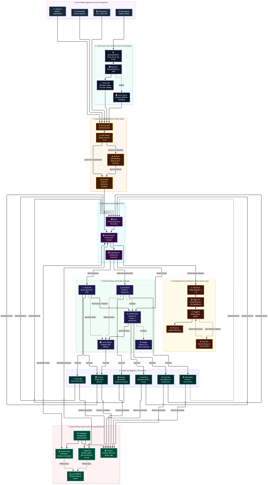

# JARVIS V2: Complete System Architecture Specification

---

## 1. High-Level Architectural Topology

  
  
<em>Figure 1: JARVIS V2 Master Architecture Specification</em>

  
  
<em>Figure 2: JARVIS V2 End-to-End Workflow Pipeline</em>

---

## 2. Architectural Subsystem Breakdown

### 2.1 Concurrency & Lifecycle
- **Wake Word Worker:** Runs continuous ONNX evaluation of `hey_jarvis` on background PyAudio frames at 16,000 Hz.
- **TTS Queue Worker:** AsyncIO loop consuming text chunks, calling Microsoft `edge-tts`, and piping audio streams directly to Pygame mixer.
- **Discord OpenClaw:** Background client checking message authors against `DISCORD_ALLOWED_USER_IDS` to prevent unauthorized remote PC control.
- **Main Agent Thread:** Manages speech acquisition, VAD filtering, orchestrator routing, and token streaming.

### 2.2 Memory Layer (Supabase pgvector + SQLite Offline Fallback)
- **Supabase PostgreSQL:** Stores structured tables (`users`, `sessions`, `messages`, `memories`, `tasks`, `audit_logs`).
- **384-Dimensional Dense Vectors:** Generated locally on CPU/GPU via `all-MiniLM-L6-v2`.
- **Hybrid Retrieval Algorithm:**
  $$\text{Final Score} = 0.70 \times \text{Cosine Similarity} + 0.30 \times \text{Importance}$$
- **Offline Cache:** When offline or missing cloud keys, operations execute transparently against SQLite with numpy vector search.

### 2.3 Security, Policy & Prompt-Injection Defense
- **Risk Level Hierarchy:**
  - **Level 0 (Conversational):** General chat, factual inquiries.
  - **Level 1 (Read-Only):** System stats, listing tasks/calendar events.
  - **Level 2 (Low-Risk Automation):** Launching apps, web searches, media playback toggle.
  - **Level 3 (Sensitive External Actions):** Sending emails, WhatsApp transfers, task deletion (**Requires Explicit User Confirmation**).
  - **Level 4 (Critical System Actions):** System shutdown, restart, workstation lock (**Requires Explicit User Confirmation**).
- **Context Isolation:** Untrusted web text and YouTube transcripts are enclosed in `<<<BEGIN_UNTRUSTED_EXTERNAL_DATA>>>` blocks to neutralize indirect prompt injection attacks.
